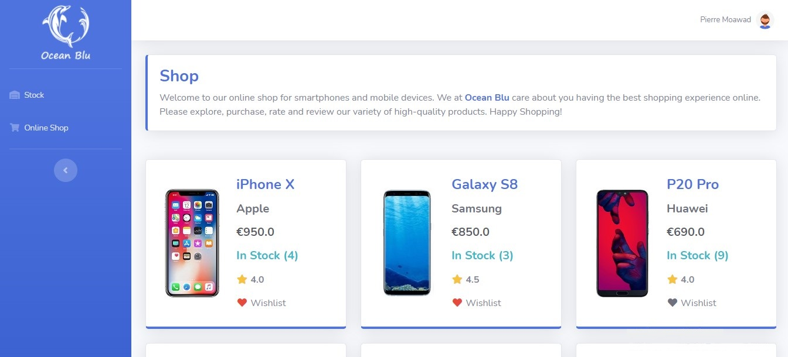

# Ocean Blu


## Table of Contents

<details open="open">
   <ul>
      <li><a href="#application-screenshots">Application screenshots</a></li>
      <li>
         <a href="#technology-stack---other-open-source-libraries">Technology stack &amp; other Open-source libraries</a>
         <ul>
            <li><a href="#data">Data</a></li>
            <li><a href="#client---frontend-ui">Client - Frontend/UI</a></li>
            <li><a href="#server---backend">Server - Backend</a></li>
            <li><a href="#libraries-and-plugins">Libraries and Plugins</a></li>
         </ul>
      </li>
      <li><a href="#features-and-to-do">Features and To-Do</a></li>
      <li>
         <a href="#installation">Installation</a>
         <ul>
            <li><a href="#prerequisites">Prerequisites</a></li>
            <li><a href="#downloading---running">Downloading & Running</a></li>
            <li><a href="#eer-diagram">EER Diagram</a></li>
         </ul>
      </li>
      <li><a href="#security">Security</a></li>
     <li>
         <a href="#files-and-directories-structure">Files and Directories Structure</a>
      </li>
   </ul>
</details>

## Application screenshots

[](documents/screenshots/scr01.jpg)

**More [Screenshots](documents/SCREENSHOTS.md)**

## Technology stack & other Open-source libraries

### Data

<details open="open">
   <ul>
      <li><a href="https://spring.io/projects/spring-data-jpa">Spring Data JPA</a> - Improve the implementation of data access layers by reducing the effort to the amount that’s actually needed</li>
      <li><a href="https://www.mysql.com/">MySQL</a> - Open-Source Relational Database Management System</li>
   </ul>
</details>

### Client - Frontend/UI

<details open="open">
   <ul>
      <li><a href="https://getbootstrap.com/">Bootstrap</a> - Bootstrap is a free and open-source CSS framework directed at responsive, mobile-first front-end web development.</li>
      <li><a href="https://startbootstrap.com/theme/sb-admin-2">SB Admin 2</a> - A free Bootstrap 4 admin theme built with HTML/CSS and a modern development workflow environment ready to use to build your next dashboard or web application.</li>
      <li><a href="https://www.thymeleaf.org/">Thymeleaf</a> - Modern server-side Java template engine for both web and standalone environments.</li>
      <li><a href="https://jquery.com/">JQuery</a> - A fast, small, and feature-rich JavaScript library. It makes things like HTML document traversal and manipulation, event handling, animation, and Ajax much simpler.</li>
   </ul>
</details>

### Server - Backend

<details open="open">
   <ul>
      <li><a href="https://www.oracle.com/technetwork/java/javase/downloads/jdk8-downloads-2133151.html">JDK</a> - Java™ Platform, Standard Edition Development Kit</li>
      <li><a href="https://spring.io/projects/spring-boot">Spring Boot</a> - Framework to ease the bootstrapping and development of new Spring Applications</li>
      <li><a href="https://maven.apache.org/">Maven</a> - Dependency Management</li>
   </ul>
</details>

###  Libraries and Plugins

<details open="open">
   <ul>
      <li><a href="https://projectlombok.org/">Lombok</a> - Never write another getter or equals method again, with one annotation your class has a fully featured builder, Automate your logging variables, and much more.</li>
      <li><a href="https://junit.org/">JUnit</a> - A unit testing framework.</li>
    </ul>
</details>

## Features and To-Do

<details open="open">
   <ul>
      <li>[x] <a href="https://spring.io/projects/spring-security">Spring Security</a> RBAC, BCrypt</li>
      <li>[x] Registering new users, login and logout</li>
      <li>[x] Browsing products through the shop</li>
      <li>[x] Viewing individual products, technical specs, ratings and reviews and purchasing the product</li>
      <li>[x] Viewing user profile and orders list</li>
      <li>[x] Rating and reviewing ordered products</li>
      <li>[x] Editing profile information and changing password via modals</li>
      <li>[x] Adding and removing products to wishlist via Ajax</li>
      <li>[x] Stock: Overseeing all the transactions' history and details and monitoring sales and purchases and any shortages in supply (<b>Admin privilege</b>)</li>
      <li>[x] Ordering additional products into the stock (<b>Admin privilege</b>)</li>
      <li>[x] Choosing between ordering existing products or a new product (<b>Admin privilege</b>)</li>
      <li>[x] Custom error pages for different response statuses</li>
      <li>[x] Unit testing</li>
      <li>[x] Integration testing</li>
      <li>[ ] Adding <a href="https://oauth.net/2/">OAuth2</a></li>
      <li>[ ] Adding dashboard (<b>Admin privilege</b>)</li>
      <li>[ ] Activating/Deactivating users and changing roles (<b>Admin privilege</b>)</li>
      <li>[ ] Adding search feature</li>
   </ul>
</details>

## Installation

Use the following instructions to download and run the project on your local machine for trying and testing the project's features.

### Prerequisites

The application uses Java 8 and MySQL. So after downloading or pulling the code on your local machine, you need to make sure that:
* MySQL is installed.
* A connection is set up.
* Set the password of the `root` user to that in the [`application.properties`](/src/main/resources/application.properties) file.

```properties
spring.datasource.username=root
spring.datasource.password=Root*597*Coz
```
Initializing the database, tables and data is handled automatically by Spring on the first run.

### Downloading & Running

There are several ways to run a Spring Boot application on your local machine. Instructions of how to run the application using the IDE or a standalone JAR will be given below.

#### Running the application with IDE

You can execute the `main` method in the `com.pierre.oceanblu.OceanBluApplication` class from your IDE.

* 	Download the zip or clone the Git repository.
* 	Unzip the zip file (if you downloaded one)
*   In the IDE click File -> Open/Import -> Existing Maven Project -> Navigate to the folder where you unzipped the zip
*   Select the project
* 	Open the Spring Boot Application file (search for @SpringBootApplication)
* 	Right-click on the file and Run as Java Application

#### Running the application with Executable JAR

The code can also be built into a jar and then executed/run. Once the jar is built, run the jar by double-clicking on it or by using the command:

```shell
$ java -jar OceanBlu.jar
```

